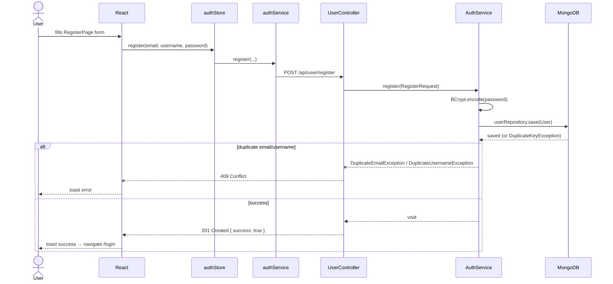
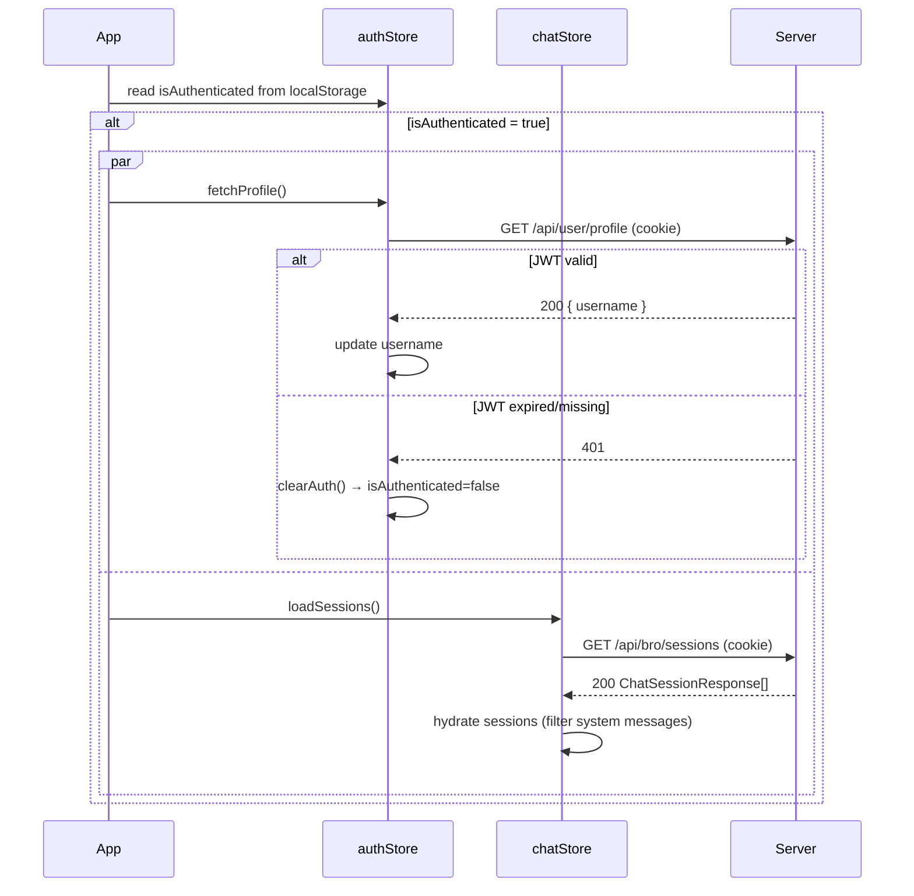
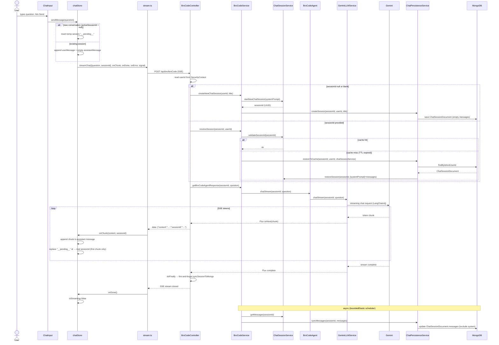
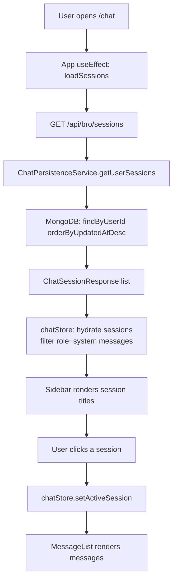
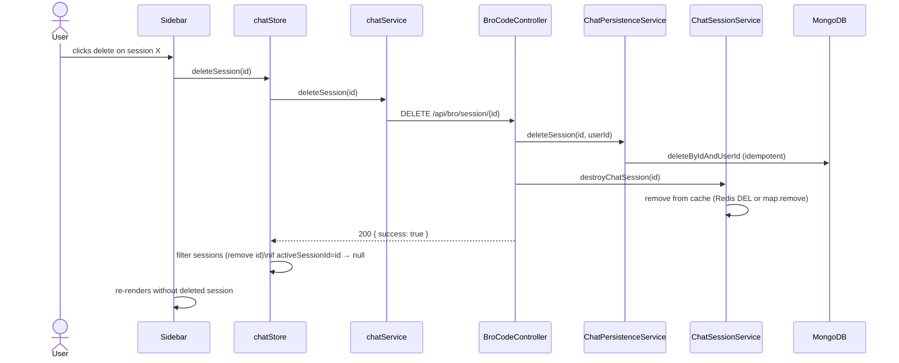
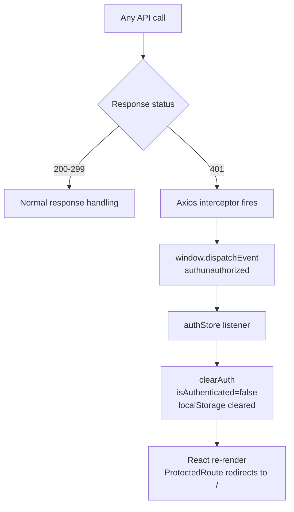
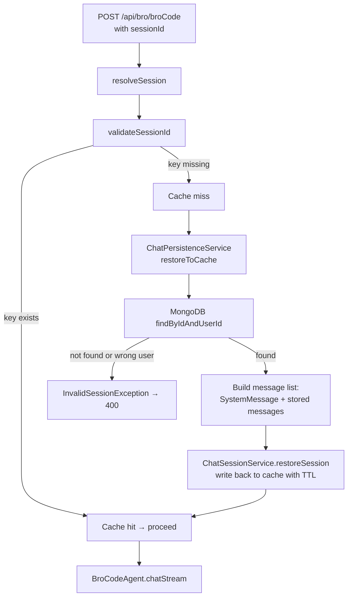

# Application Flow — BroCode

---

## 1. User Registration



---

## 2. User Login

```mermaid
sequenceDiagram
    actor User
    participant React
    participant authStore
    participant authService
    participant UserController
    participant AuthService
    participant JwtUtil
    participant MongoDB

    User->>React: fills LoginPage form
    React->>authStore: login(identifier, password)
    authStore->>authService: login(...)
    authService->>UserController: POST /api/user/login
    UserController->>AuthService: login(AuthRequest)
    AuthService->>MongoDB: findByEmail or findByUsername
    MongoDB-->>AuthService: User | empty
    alt user not found
        AuthService--xUserController: InvalidCredentialsException
        UserController-->>React: 401
        React-->>User: toast error
    else wrong password
        AuthService->>AuthService: passwordEncoder.matches → false
        AuthService--xUserController: InvalidCredentialsException
        UserController-->>React: 401
        React-->>User: toast error
    else valid
        AuthService->>JwtUtil: generateToken(userId)
        JwtUtil-->>AuthService: JWT string
        AuthService-->>UserController: AuthResponse(username, token)
        UserController->>React: 200 + Set-Cookie: token=<JWT>; HttpOnly; SameSite=Strict
        React->>authStore: setState(isAuthenticated=true, username)
        authStore->>localStorage: setItem("isAuthenticated","true")
        authStore->>localStorage: setItem("username", username)
        React-->>User: navigate /chat
    end
```

---

## 3. App Load / Session Verification

On every page load the app reads `isAuthenticated` from localStorage. If true, it fires two parallel calls to validate the JWT server-side and hydrate sessions.



---

## 4. Sending a Chat Message (SSE Streaming)

This is the core flow. The frontend optimistically adds the user + assistant messages, then streams tokens from the server into the assistant bubble.



---

## 5. Session Management

### 5a. Load session history on page load



### 5b. Delete a session



---

## 6. Logout

```mermaid
sequenceDiagram
    actor User
    participant Navbar
    participant authStore
    participant authService
    participant UserController

    User->>Navbar: clicks Logout
    Navbar->>authStore: logout()
    authStore->>authService: logout()
    authService->>UserController: POST /api/user/logout
    UserController->>UserController: Set-Cookie: token=; Max-Age=0; HttpOnly
    UserController-->>authStore: 200 { success: true }
    authStore->>authStore: clearAuth()\nisAuthenticated=false, username=null
    authStore->>localStorage: removeItem("isAuthenticated")\nremoveItem("username")
    authStore-->>Navbar: state update
    Navbar->>Navbar: navigate /
```

---

## 7. Unauthorized Request Handling (401 Auto-Logout)

When any API call returns 401 (JWT expired mid-session), the Axios interceptor automatically signs the user out without requiring explicit logout.



---

## 8. Cache Miss Restoration Flow

When a user resumes a session whose cache TTL has expired (default 30 min), the backend transparently restores it from MongoDB before querying the LLM.


