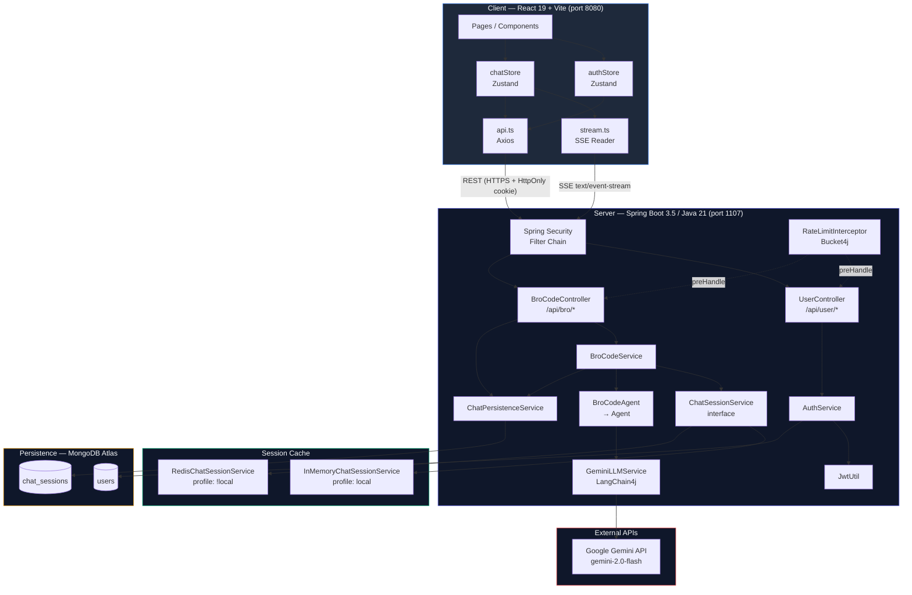

# High Level Design — BroCode

## System Overview

BroCode is a full-stack AI coding assistant. The frontend is a single-page React app; the backend is a stateless Spring Boot service that proxies user prompts to Google Gemini via LangChain4j. Conversation history lives in two tiers: a fast cache (Redis in production, JVM heap locally) and a durable MongoDB store.

---

## Architecture Diagram

---

## Component Responsibilities

| Layer | Component | Responsibility |
|---|---|---|
| **Frontend** | `authStore` | Auth state (isAuthenticated, username), login/logout/fetchProfile actions |
| **Frontend** | `chatStore` | Session list, SSE streaming state, sendMessage / deleteSession actions |
| **Frontend** | `stream.ts` | Native `EventSource`-style SSE parser; hands chunks to chatStore |
| **Frontend** | `api.ts` | Axios instance with `withCredentials: true`; dispatches `auth:unauthorized` on 401 |
| **Backend** | `JwtFilter` | Reads `token` HttpOnly cookie, validates JWT, sets `SecurityContext` principal to `userId` |
| **Backend** | `RateLimitInterceptor` | Per-IP limit on login/register (Bucket4j); per-userId limit on `/api/bro/broCode` |
| **Backend** | `UserController` | Register, login, logout, get/update profile |
| **Backend** | `BroCodeController` | SSE streaming chat, list sessions, delete session |
| **Backend** | `BroCodeService` | Orchestrates session lifecycle: create → stream → sync |
| **Backend** | `ChatPersistenceService` | All MongoDB reads/writes for `ChatSessionDocument` |
| **Backend** | `ChatSessionService` | Interface over the live cache tier (InMemory or Redis) |
| **Backend** | `BroCodeAgent` → `Agent` | Selects the right LLM call variant (bare / tools / RAG / tools+RAG) |
| **Backend** | `GeminiLLMService` | Wraps LangChain4j `StreamingChatLanguageModel`; returns `Flux<String>` |
| **Backend** | `GlobalExceptionHandler` | Maps typed exceptions to HTTP status codes; never leaks stack traces |

---

## Communication Protocols

| Direction | Protocol | Auth |
|---|---|---|
| Browser → REST endpoints | HTTPS POST/GET/DELETE | HttpOnly JWT cookie |
| Browser → SSE stream | HTTPS POST + `text/event-stream` | HttpOnly JWT cookie |
| Server → Gemini | HTTPS (LangChain4j client) | API key (env var) |
| Server → MongoDB | MongoDB wire protocol | Atlas connection string (env var) |
| Server → Redis | Redis protocol | Password (env var, production only) |

---

## Deployment Profiles

| Profile | Session Cache | Redis required |
|---|---|---|
| `local` (default dev) | `InMemoryChatSessionService` | No |
| `staging` / `prod` | `RedisChatSessionService` | Yes |
