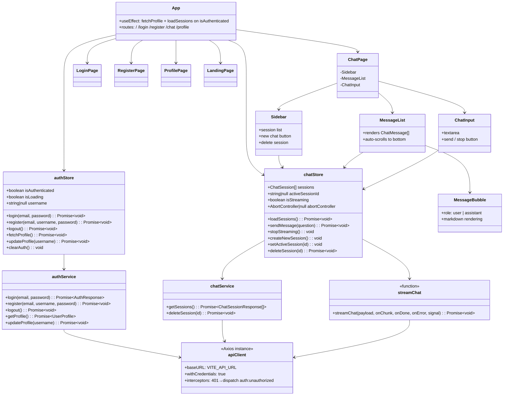
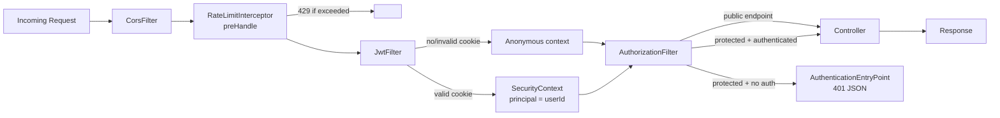

# Low Level Design — BroCode

## Backend Class Diagram

```mermaid
classDiagram
    direction TB

    %% ── Controllers ──────────────────────────────────────────────────────────
    class UserController {
        -AuthService authService
        +register(RegisterRequest) : ResponseEntity
        +login(AuthRequest) : ResponseEntity
        +logout(HttpServletResponse) : ResponseEntity
        +getProfile(String userId) : ResponseEntity
        +updateProfile(String userId, UpdateProfileRequest) : ResponseEntity
    }

    class BroCodeController {
        -BroCodeService broCodeService
        -ChatPersistenceService chatPersistenceService
        -ChatSessionService chatSessionService
        +getBroCode(QuestionDto) : Flux~ResponseDto~
        +getSessions() : ResponseEntity~List~
        +deleteSession(String id) : ResponseEntity
    }

    %% ── Services ─────────────────────────────────────────────────────────────
    class AuthService {
        -UserRepository userRepository
        -PasswordEncoder passwordEncoder
        -JwtUtil jwtUtil
        +register(RegisterRequest) : void
        +login(AuthRequest) : AuthResponse
        +getUsername(String userId) : String
    }

    class BroCodeService {
        -ChatSessionService chatSessionService
        -BroCodeAgent broCodeAgent
        -ChatPersistenceService chatPersistenceService
        +createNewChatSession(String userId, String title) : String
        +resolveSession(String sessionId, String userId) : String
        +getBroCodeAgentResponse(String sessionId, String question) : Flux~String~
        +syncSessionToMongo(String sessionId) : void
    }

    class ChatPersistenceService {
        -ChatSessionRepository chatSessionRepository
        +createSession(String sessionId, String userId, String title) : void
        +getUserSessions(String userId) : List~ChatSessionResponse~
        +syncMessages(String sessionId, List~ChatMessage~) : void
        +deleteSession(String sessionId, String userId) : void
        +restoreToCache(String sessionId, String userId, ChatSessionService) : void
    }

    class GeminiLLMService {
        -StreamingChatLanguageModel model
        -RateLimiter rateLimiter
        +chatStream(String sessionId, String question) : Flux~String~
        +chatStream(ContentRetriever, String, String) : Flux~String~
        +chatStream(Tools, String, String) : Flux~String~
        +chatStream(ContentRetriever, Tools, String, String) : Flux~String~
    }

    %% ── Session Cache (interface + two impls) ────────────────────────────────
    class ChatSessionService {
        <<interface>>
        +startNewChatSession(String systemPrompt) : String
        +addChatMessage(String sessionId, ChatMessage) : void
        +validateSessionId(String sessionId) : void
        +getMessages(Object memoryId) : List~ChatMessage~
        +updateMessages(Object memoryId, List~ChatMessage~) : void
        +deleteMessages(Object memoryId) : void
        +restoreSession(String sessionId, List~ChatMessage~) : void
        +destroyChatSession(String sessionId) : void
        +getChatSessionContext(String sessionId) : ChatSessionContext
    }

    class InMemoryChatSessionService {
        -Map~String, ChatSession~ sessions
        -int sessionTtlMinutes
        +startNewChatSession(String) : String
        +validateSessionId(String) : void
        +evictExpiredSessions() : void  %%@Scheduled
    }

    class RedisChatSessionService {
        -StringRedisTemplate redis
        -ObjectMapper objectMapper
        -int sessionTtlMinutes
        +startNewChatSession(String) : String
        -persist(String, List~ChatMessage~) : void
        -load(String) : List~ChatMessage~
        -touch(String) : void
    }

    %% ── Agent layer ──────────────────────────────────────────────────────────
    class Agent {
        -Tools tools
        -LLMService llmService
        +chatStream(String sessionId, String question) : Flux~String~
        #getContentRetriever() : ContentRetriever
    }

    class BroCodeAgent {
        +BroCodeAgent(LLMService)
    }

    %% ── Security ─────────────────────────────────────────────────────────────
    class JwtFilter {
        -JwtUtil jwtUtil
        +doFilterInternal(request, response, chain) : void
    }

    class JwtUtil {
        -String secretString
        -long expirationTime
        -SecretKey secretKey
        +generateToken(String userId) : String
        +extractUsername(String token) : String
        +extractUserId(String token) : String
        +validateToken(String token) : boolean
        +init() : void  %%@PostConstruct
    }

    class RateLimitInterceptor {
        -Map~String,Bucket~ loginBuckets
        -Map~String,Bucket~ registerBuckets
        -Map~String,Bucket~ chatBuckets
        +preHandle(request, response, handler) : boolean
    }

    %% ── Repositories ─────────────────────────────────────────────────────────
    class UserRepository {
        <<interface MongoRepository>>
        +findByEmail(String) : Optional~User~
        +findByUsername(String) : Optional~User~
    }

    class ChatSessionRepository {
        <<interface MongoRepository>>
        +findByUserIdOrderByUpdatedAtDesc(String) : List~ChatSessionDocument~
        +findByIdAndUserId(String, String) : Optional~ChatSessionDocument~
        +deleteByIdAndUserId(String, String) : void
    }

    %% ── Models ───────────────────────────────────────────────────────────────
    class User {
        +String id
        +String email
        +String username
        +String password
    }

    class ChatSessionDocument {
        +String id
        +String userId
        +String title
        +List~StoredMessage~ messages
        +Instant createdAt
        +Instant updatedAt
    }

    class StoredMessage {
        +String role
        +String content
    }

    %% ── Relationships ────────────────────────────────────────────────────────
    BroCodeController --> BroCodeService
    BroCodeController --> ChatPersistenceService
    BroCodeController --> ChatSessionService

    UserController --> AuthService

    BroCodeService --> ChatSessionService
    BroCodeService --> BroCodeAgent
    BroCodeService --> ChatPersistenceService

    AuthService --> UserRepository
    AuthService --> JwtUtil

    ChatPersistenceService --> ChatSessionRepository
    ChatSessionDocument *-- StoredMessage

    ChatSessionService <|.. InMemoryChatSessionService
    ChatSessionService <|.. RedisChatSessionService

    Agent <|-- BroCodeAgent
    Agent --> GeminiLLMService

    JwtFilter --> JwtUtil

    UserRepository --> User
    ChatSessionRepository --> ChatSessionDocument
```

---

## Frontend Component & Store Diagram

---

## Spring Security Filter Chain

---

## Data Models

### `User` (MongoDB collection: `users`)

| Field | Type | Constraint |
|---|---|---|
| `id` | String | `@Id`, auto-generated |
| `email` | String | unique index |
| `username` | String | unique index |
| `password` | String | BCrypt hashed |

### `ChatSessionDocument` (MongoDB collection: `chat_sessions`)

| Field | Type | Notes |
|---|---|---|
| `id` | String | `@Id`, UUID assigned at session creation |
| `userId` | String | indexed — queries always filter by this |
| `title` | String | first 50 chars of the opening question |
| `messages` | `List<StoredMessage>` | excludes system messages |
| `createdAt` | Instant | `@CreatedDate` |
| `updatedAt` | Instant | `@LastModifiedDate` |

### `StoredMessage` (embedded in ChatSessionDocument)

| Field | Type | Values |
|---|---|---|
| `role` | String | `"user"`, `"assistant"` (system excluded from storage) |
| `content` | String | plain text |

---

## Rate Limit Configuration (Bucket4j)

| Endpoint | Key | Capacity | Refill |
|---|---|---|---|
| `POST /api/user/login` | client IP | 10 | 10 per minute |
| `POST /api/user/register` | client IP | 5 | 5 per 10 minutes |
| `POST /api/bro/broCode` | userId | 3 | 3 per minute |
